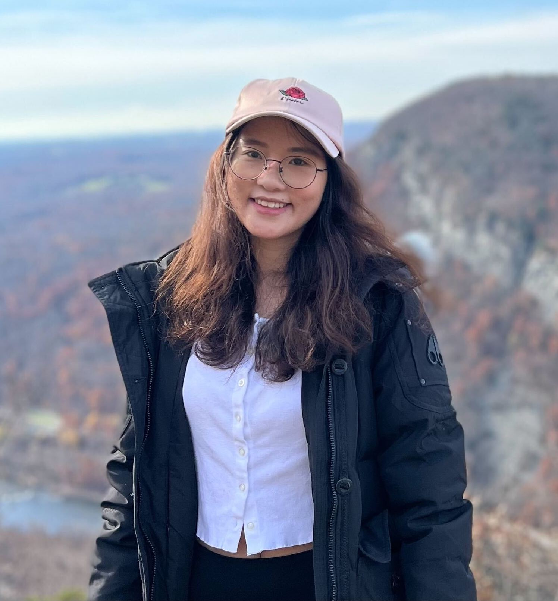

---
#
# By default, content added below the "---" mark will appear in the home page
# between the top bar and the list of recent posts.
# To change the home page layout, edit the _layouts/home.html file.
# See: https://jekyllrb.com/docs/themes/#overriding-theme-defaults
#
layout: home
---

<!--  -->

<h2 class="blackpar_title">Efficient Natural Language and Multimodal Models</h2>

The landscape of AI has been significantly altered by the advances in large-scale pre-trained models, laying the groundwork for more general AI and allowing us to reach previously unattainable performance levels in natural language processing and multimodal learning. Despite the empirical success, these large-scale models require an enormous amount of computation to achieve high performance, hindering their deployment in devices with low memory and strict latency requirements. Additionally, these models often rely on large amounts of labeled training data that are difficult to acquire or annotate for many tasks, including those dealing with sensitive user data. Challenges also arise about how the model can continuously improve itself with feedback signals from users. We propose to organize a one-day track, focusing on model/data efficiency to build large-scale models.

This event aims to bring together experts in machine learning, natural language processing, optimization, and systems to stimulate vibrant discussions toward a deeper and more explicit understanding of the connections in between and to foster new research directions toward advanced approaches to improve the efficiency of various NLP and multimodal models.

<!-- Call for Papers -->
<h2 class="blackpar_title" id="Call for Papers">Call for Papers</h2>

We encourage the community to submit their solutions, ideas, and ongoing work concerning efficiency for NLP and multimodal models. The scope of this workshop includes, but not limited to, the following topics.

<ul>
	<li>Fast pre-training techniques, avoiding pre-training from scratch</li>
	<li>Multi-domain pre-training/fine-tuning and fast domain adaptation for pre-trained/fine tuned models</li>
	<li>Multimodal pre-trained (e.g., text--speech) models</li>
	<li>Avoiding task-specific fine tuning of pre-trained models</li>
	<li>New efficient architectures for pre-trained models</li>
</ul>

<h2 class="blackpar_title">Submission Instructions</h2>

The submission website will be up shortly. All the submitted papers have to be anonymous for double-blind review. We expect each paper will be reviewed by at least three reviewers. The content of the paper (excluding the references and supplementary materials) should not be longer than 8 pages, following the ACL template style (which can be found <a href="https://github.com/acl-org/acl-style-files">here</a>). 
  
Authors can submit up to 100 MB of supplementary materials separately. Authors are highly encouraged to submit their codes for reproducibility purposes. Although original submissions are preferred, submitted papers can be among your already published or ArXiv papers, and your under submission works. Please make sure to indicate the complete list of conflict of interests for all the authors of your paper. To encourage higher quality submissions, our sponsors are offering the Best Paper Award to qualified outstanding original oral and poster presentations (upon nomination of the reviewers). Bear in mind that our workshop is not archival, but the accepted papers will be hosted on the workshop website.

  
<!--Confirmed Speakers-->
<h2 class="blackpar_title" id="Confirmed Spearkers">Confirmed Speakers</h2>

	

	  
	  

		

		<h6>
			<b>Prof. Yejin Choi</b>
			 
			University of Washington (Allen Institute for AI)
		</h6>
		

	  

	

	

	  
	  

		

		<h6>
			<b>Prof. Yoon Kim</b>
			 
            Massachusetts Institute of Technology
		</h6>
		

	  

	

	<!--div class="card_perso column_perso">
	  
	  

		

		<h6>
			<b>Prof. Emma Strubell</b>
			 
            Carnegie Mellon University
		</h6>
		

	  

	</div-->
	

	  
	  

		

		<h6>
			<b>Dr. Chunting Zhou</b>
			 
            Meta AI Research
		</h6>
		

	  

	

	

	  
	  

		

		<h6>
			<b>Prof. Sameer Singh</b>
			 
            University of California Irvine
		</h6>
		

	  

	

	

	  
	  

		

		<h6>
			<b>Prof. Bang Liu</b>
			 
            University of Montreal
		</h6>
		

	  

	

	

	  
	  

		

		<h6>
			<b>Dr. Jianfeng Gao</b>
			 
            Microsoft Research
		</h6>
		

	  

	

   
<!--h2 class="blackpar_title" id="Schedule">Schedule (EST time zone - New York/Montreal/Toronto)</h2>

<!-- insert pop ups here -->

<!-- -->

	<table id="customers">
		<tr>
			<th>Time</th>
			<th colspan="2">Title</th>
			<th>Presenter</th>
		</tr>
		
		
		<!-- insert table here -->
		
		
		
		
		<!-- -->

	</table>
</div-->

   
<!-- Organizers -->
<h2 class="blackpar_title" id="Organizers">Organizers</h2>

	

	  
	  

		

		<h6>
			<b>Yuntian Deng</b>
			 
            Harvard University
		</h6>
		

	  

	

	

	  
	  

		

		<h6>
			<b>Mengzhou Xia</b>
			 
            Princeton University
		</h6>
		

	  

	

	

	  
	  

		

		<h6>
			<b>Mehdi Rezagholizadeh</b>
			 
            Huawei Noah's Ark Lab
		</h6>
		

	  

	

	

	  
	  

		

		<h6>
			<b>Yue Dong</b>
			 
            University of California, Riverside
		</h6>
		

	  

	

	

	  
	  

		

		<h6>
			<b>Shiyu Chang</b>
			 
            UC Santa Barbara
		</h6>
		

	  

	

	

	  
	  

		

		<h6>
			<b>Yu Cheng</b>
			 
            Microsoft Research
		</h6>
		

	  

	

<h2 class="blackpar_title" id="Organizers">Advisory Committee</h2>

	

	  
	  

		

		<h6>
			<b>Khalil Bibi</b>
			 
			Huawei Noah's Ark Lab
		</h6>
		

	  

	

	

	  
	  

		

		<h6>
			<b>Andrson Avilla</b>
			 
			Huawei Noah's Ark Lab
		</h6>
		

	  

	

  
<!-- Technical Committee -->
<h2 class="blackpar_title" id="Technical Committee">Technical Committee</h2>
<table>
	<tr>
		<td>
			<ul>
				<li>Pascal Poupart (UoWaterloo)</li>
				<li>Kevin Duh (Johns Hopkins University)</li>
				<li>Wulong Liu (Huawei Noah's Ark Lab)</li>
				<li>Bang Liu (UoMontreal)</li>
				<li>Di Jin (Amazon Alexa AI)</li>
				<li>Hamidreza Mahyar (McMaster University)</li>
				<li>Lili Mou (UoAlberta)</li>
				<li>Peyman Passban (Amazon)</li>
				<li>Prasanna Parthasarathi (McGill & MILA)</li> 
				<li>Vahid Partovi Nia (Huawei Noah's Ark Lab)</li>
				<li>Yue Dong (McGill  & MILA)</li>
				<li>Ivan Kobyzev (Huawei Noah's Ark Lab)</li>
				<li>Jad Kabbara (McGill  & MILA)</li> 
				<li>Aref Jafari (UoWaterloo)</li> 
				<li>Ahmad Rashid (Huawei Noah's Ark Lab)</li> 
				<li>Shailza Jolly (TU Kaiserslautern)</li> 
				<li>Md. Akmal Haidar (Nuance Communications)</li> 
				<li>Jingjing Xu (ByteDance)</li> 
				<li>Vasileios Lioutas (UoBritish Colombia (UBC))</li> 
				<li>Anderson R. Avila (Huawei Noah's Ark Lab)</li> 
				<li>Malik H. Altakrori (McGill & MILA)</li> 
				<li>Ali Vahdat (Thomson Reuters)</li> 
				<li>Fattane Zarrinkalam (Thomson Reuters)</li> 
				<li>Makesh S Narsimhan (McGill & MILA)</li> 
				<li>Borna Jafarpour (Thomson Reuters)</li> 
				<li>Shohreh Shaghaghian (Thomson Reuters)</li> 
				<li>Ehsan Kamalloo (UoAlberta)</li>
				<li>Ali Saheb Pasand (UoWaterloo)</li>
			</ul>
		</td>
		<td>
			<ul>
				<li>Abbas Ghaddar (Huawei Noah's Ark Lab)</li>
				<li>Mehrdad Ganjeh (Ernst & Young (EY))</li>
				<li>Mingxuan Wang (ByteDance)</li>
				<li>Tanya Roosta (Amazon)</li>
				<li>Soheila Samiee (BASF)</li>
				<li>Yimeng Wu (Huawei Noah's Ark Lab)</li>
				<li>Marzieh Tahaei (Huawei Noah's Ark Lab)</li>
				<li>Habib Hajimolahoseini (Huawei Technologies)</li>
				<li>Mohammad Salameh (Huawei Technologies)</li>
				<li>Kira Aveline Selby (UoWaterloo)</li>
				<li>Mohammed Senoussaoui (Fluent.ai)</li>
				<li>M. Sarria-Paja (Universidad Santiago de Cali)</li>
				<li>Puneeth Saladi (Huawei Noah's Ark Lab)</li>
				<li>Flávio Ávila (Verisk Analytics)</li>
				<li>Tal Schuster (MIT)</li>
				<li>Irene Li (Yale)</li>
				<li>Shentong Mo (Carnegie Mellon University)</li>
				<li>Alpana Agarwal (Thapar University)</li>
				<li>Vinay Kumar (Thapar University)</li>
				<li>Shivani Malhotra (TIET Patiala)</li>
				<li>Iman Keivanloo (Amazon)</li>
				<li>Aashiq Muhamed (Amazon)</li>
				<li>Robert L. Logan IV (UCI University)</li>
				<li>Patrick Xia (Johns Hopkins University)</li>
				<li>Moshe Wasserblat (Intel)</li>
				<li>Guy Boudoukh (Intel)</li>
				<li>Ankit Chadha (Amazon)</li>
				<li>Khalil Bibi (Huawei Noah's Ark Lab)</li>
				<li>David Alfonso Hermelo (Huawei Noah's Ark Lab)</li>
			</ul>
		</td>
	</tr>
</table>

<!--
<ul>
	<li>Ali Ghodsi (University of Waterloo)</li>
	<li>Bang Liu (University of Montreal (UDM))</li>
	<li>Di Jin (Amazon Alexa AI)</li>
	<li>Hamidreza Mahyar (McMaster University)</li>
	<li>Kevin Duh (Johns Hopkins University)</li>
	<li>Lili Mou (University of Alberta)</li>
	<li>Pascal Poupart (University of Waterloo)</li>
	<li>Peyman Passban (Amazon)</li>
	<li>Prasanna Parthasarathi (McGill University & MILA)</li> 
	<li>Vahid Partovi Nia (Huawei Noah's Ark Lab)</li>
	<li>Wulong Liu (Huawei Noah's Ark Lab)</li>
	<li>Yue Dong (McGill University & MILA)</li>
	<li>Ivan Kobyzev (Huawei Noah's Ark Lab)</li>
	<li>Jad Kabbara (McGill University & MILA)</li> 
	<li>Aref Jafari (University of Waterloo)</li> 
	<li>Ahmad Rashid (Huawei Noah's Ark Lab)</li> 
	<li>Shailza Jolly (TU Kaiserslautern)</li> 
	<li>Md. Akmal Haidar (Huawei Noah's Ark Lab)</li> 
	<li>Jingjing Xu (ByteDance)</li> 
	<li>Vasileios Lioutas (University of British Colombia (UBC))</li> 
	<li>Anderson R. Avila (Huawei Noah's Ark Lab)</li> 
	<li>Malik H. Altakrori (Mc Gill University & MILA)</li> 
	<li>Ali Vahdat (Thomson Reuters)</li> 
	<li>Fattane Zarrinkalam (Thomson Reuters)</li> 
	<li>Makesh S Narsimhan (McGill University & MILA)</li> 
	<li>Nasrin Taghizadeh (University of Tehran)</li> 
	<li>Borna Jafarpour (Thomson Reuters)</li> 
	<li>Shohreh Shaghaghian (Thomson Reuters)</li> 
	<li>Ehsan Kamalloo (University of Alberta)</li>
	<li>Ali Saheb Pasand (University of Waterloo)</li>
	<li>Abbas Ghaddar (Huawei Noah's Ark Lab)</li>
	<li>Mehrdad Ganjeh (Ernst & Young (EY))</li>
	<li>Mingxuan Wang (ByteDance)</li>
	<li>Tanya Roosta (Amazon)</li>
	<li>Soheila Samiee (BASF)</li>
	<li>Yimeng Wu (Huawei Noah's Ark Lab)</li>
	<li>Omar Mohamed Awad (Huawei Technologies)</li>
	<li>Marzieh Tahaei (Huawei Noah's Ark Lab)</li>
	<li>Habib Hajimolahoseini (Huawei Technologies)</li>
	<li>Mohammad Salameh (Huawei Technologies)</li>
	<li>Kira Aveline Selby (University of Waterloo)</li>
	<li>Mohammed Senoussaoui (Fluent.ai)</li>
	<li>M. Sarria-Paja (Universidad Santiago de Cali)</li>
	<li>Puneeth Saladi (Huawei Noah's Ark Lab)</li>
	<li>Flávio Ávila (Verisk Analytics)</li>
	<li>Tal Schuster (MIT)</li>
	<li>Irene Li (Yale)</li>
	<li>Rongsheng Zhang</li>
	<li>Shentong Mo (Carnegie Mellon University)</li>
	<li>Alpana Agarwal (Thapar Institute of Engineering & Technology)</li>
	<li>Vinay Kumar (Thapar Institute of Engineering & Technology)</li>
	<li>Shivani Malhotra (Thapar Institute of Engineering & Technology)</li>
	<li>Iman Keivanloo (Amazon)</li>
	<li>Aashiq Muhamed (Amazon)</li>
	<li>Robert L. Logan IV (UCI University)</li>
	<li>Patrick Xia (Johns Hopkins University)</li>
	<li>Moshe Wasserblat (Intel)</li>
	<li>Guy Boudoukh (Intel)</li>
	<li>Ankit Chadha (Amazon)</li>
	<li>Khalil Bibi (Huawei Noah's Ark Lab)</li>
</ul>
-->
  
